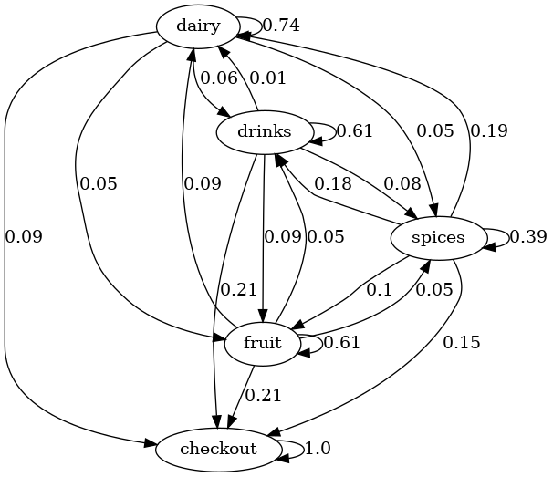

# Markov Simulation
In this project, customer behaviour in a supermarket is analyzed and simulated in an animation via MCMC

## Table of Contents
- [General info](#general-info)
- [Technologies and Libraries](#technologies-and-libraries)

### General info
#### The transition matrix of the markov-chain

### Technologies and Libraries
- Python 3.8
- OpenCV
- pandas
- numpy
- random
- datetime
- time

### Setup
For optimal simulation of customers in a supermarkt, execute the project (MCMC_Animation.py) in **Visual Studio Code** or in your terminal.

